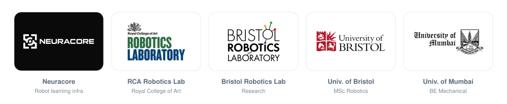

  

  

  

    
    
    
    
  

  

## About

I'm a robotics developer. I like the part where a model leaves the notebook and has to survive a real robot. I also founded [ARTHÉ](https://www.linkedin.com/company/arthe/), an open-source robotics community.

  

## Highlights

Each project sits on the loop I work in: **perception** sees, **cognition** reasons, **action** moves.

<table>
  <tr>
    <td width="50%" valign="top">
      <h3><a href="https://github.com/pgeedh/GeminiRobotics-InsightHub">Gemini Robotics Playbook</a></h3>
       <b>Gemini Robotics ER 2.0 · VLA 2.0 · ROS 2</b>  
      A developer cookbook for Google DeepMind's Gemini Robotics: 31 prompt cards for spatial grounding, grasping, motion planning and safety, a ROS 2 bridge, and the official benchmarks. Translated into 4 languages.
    </td>
    <td width="50%" valign="top">
      <h3><a href="https://github.com/huggingface/lerobot/pulls?q=author%3Apgeedh">LeRobot contributions</a></h3>
       <b>Hugging Face · PyTorch · robot learning</b>  
      Open pull requests to Hugging Face's LeRobot evaluation pipeline: persisting recorded datasets across batched evals and adding provenance metadata to eval results. Also contributing fixes to VLA-Adapter.
    </td>
  </tr>
  <tr>
    <td width="50%" valign="top">
      <h3><a href="https://github.com/pgeedh/NintAi-The-AI-Powered-Bike-Fit-Studio">NintAi</a> ⭐ 22</h3>
       <b>YOLO11 · Gemini · computer vision</b>  
      A bike-fit studio on your laptop. YOLO11 tracks your pose while you pedal, and Gemini writes an expert-level fit report from the biomechanics.
    </td>
    <td width="50%" valign="top">
      <h3><a href="https://github.com/pgeedh/Gemma-Sense-Contextual_Model">GemmaSense</a></h3>
       <b>PaliGemma 2 · Gemini · edge + cloud</b>  
      A hybrid vision-language brain for robots. A quantized PaliGemma 2 runs on-device, and the system escalates to Gemini in the cloud when confidence drops, so a kitchen robot can make sense of a workshop.
    </td>
  </tr>
</table>

<b>More projects</b>

 

| Project | What it does |
|---|---|
| [**Open-ENPIRE-Gripper**](https://github.com/pgeedh/Open-ENPIRE-Gripper) | Open design of NVIDIA's ENPIRE compliant gripper, adapted to other robot arms (Robotiq Hand-E, OpenArm) |
| [**WorldLab Robotics Examples**](https://github.com/pgeedh/WorldLab-RoboticsExamples) | Photorealistic digital-twin environments for robot training, generated with World Labs |
| [**Reachy-Mini · Gemini + PersonaPlex**](https://github.com/pgeedh/Reachy-Mini-Gemini-PersonaPlex-Edition) | An empathetic desktop robot with Gemini vision, voice wake-words and 15+ physical expressions |
| [**humanoid-mujoco**](https://github.com/pgeedh/humanoid-mujoco) | Unitree G1 humanoid jumping over obstacles in MuJoCo physics |
| [**UPenn Robotics Specialization**](https://github.com/pgeedh/RoboticsSpecialization-UPenn-AerialRobotics) ⭐ 26 | Aerial robotics, perception, estimation, planning and mobility coursework |

<b>Toolbox</b>

 

| Perception | Cognition | Action |
|---|---|---|
| PyTorch · TensorFlow · OpenCV · YOLO11 · Open3D · CUDA | ROS 2 · Nav2 · Hugging Face LeRobot / VLA · NVIDIA AI · Linux | Isaac Sim · MuJoCo · Gazebo · PX4 · Jetson Orin · Raspberry Pi · Foxglove |

## Work with me

Research collaboration, talks and partnerships, or a mentoring call.

  
  

